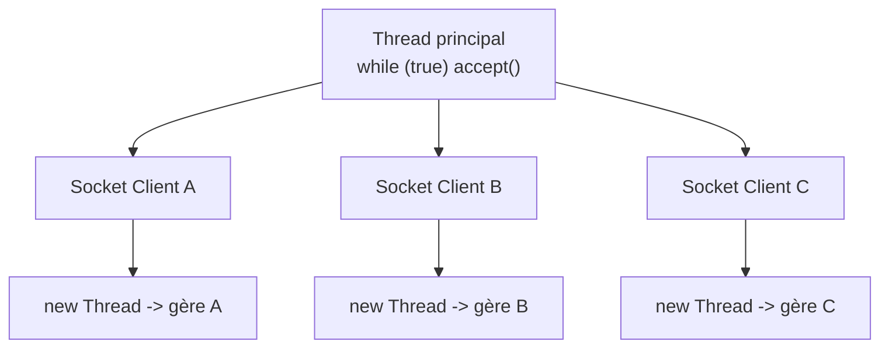
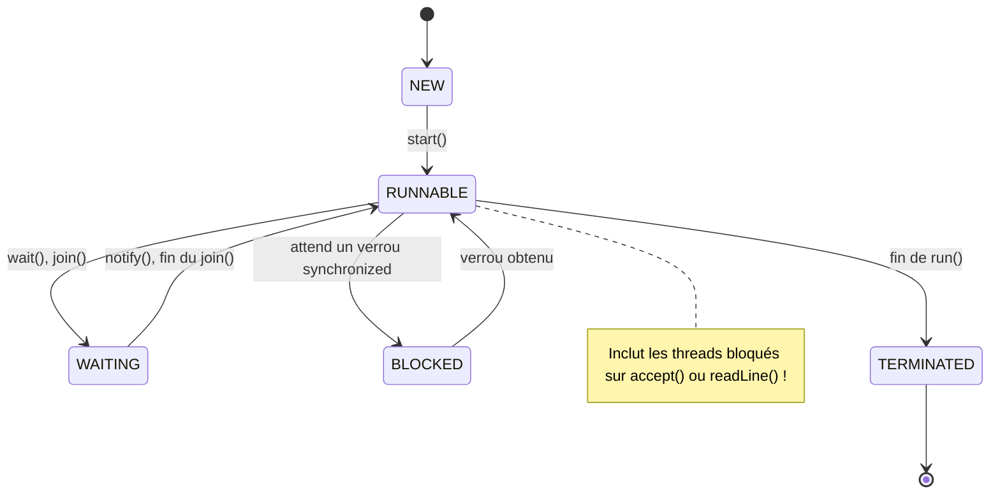
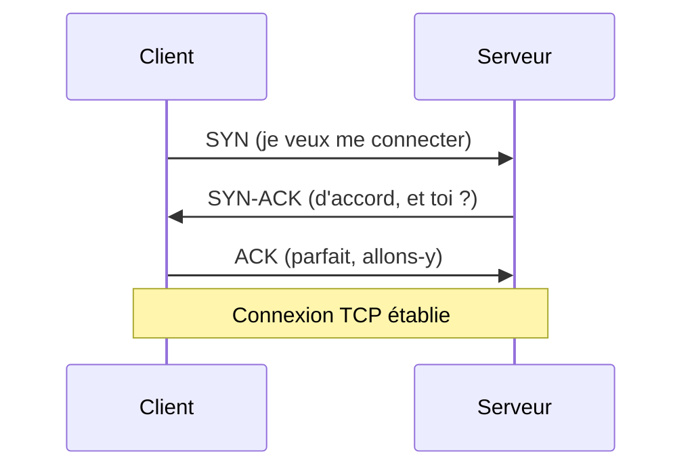
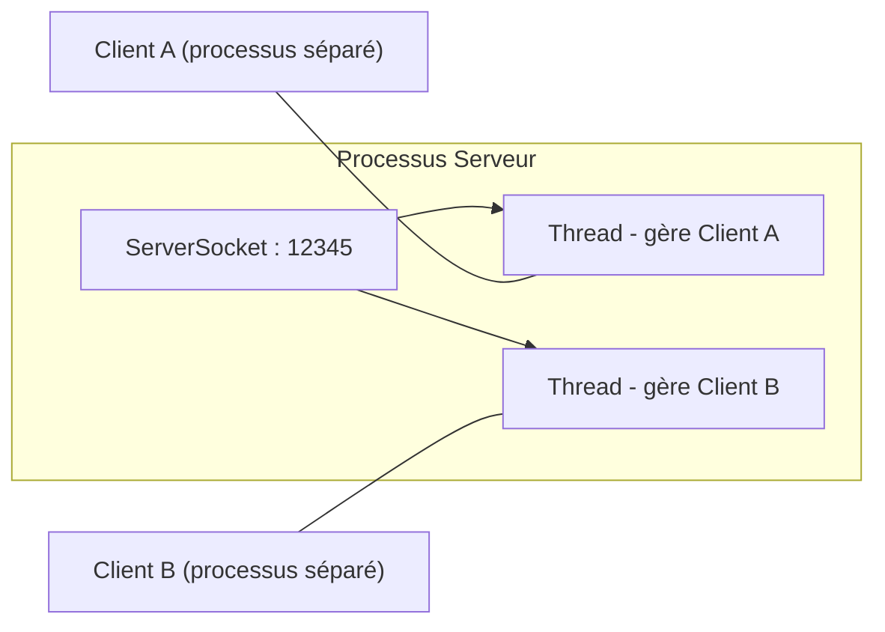
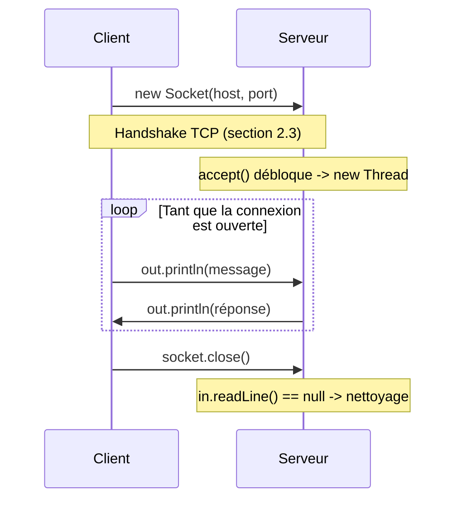
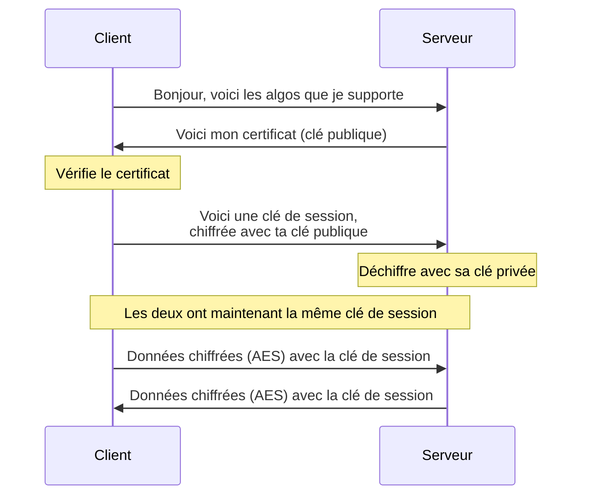
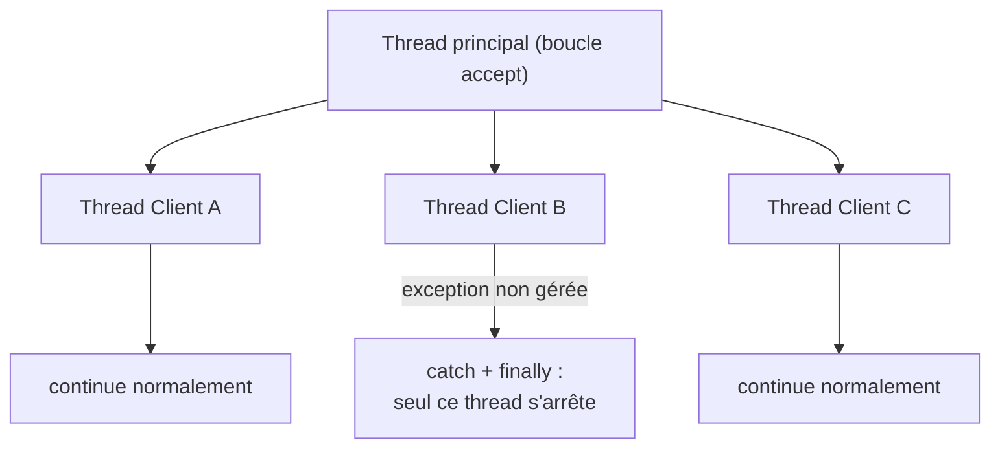
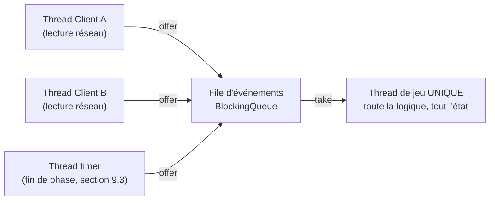

# Cours : réseau, client-serveur, protocole et sécurité en Java
### À l'usage de ton projet Loup-Garou — version complète (corrigée et augmentée)

Ce document couvre, dans l'ordre, tout ce dont tu as besoin pour construire la couche réseau de ton projet : comment Java gère la concurrence (threads), comment fonctionne un réseau TCP, comment établir et maintenir une connexion client-serveur, comment concevoir ton propre protocole (texte **et** binaire), comment sécuriser les échanges, comment rendre ton serveur robuste face aux erreurs, comment détecter les joueurs dont la connexion a coupé sans prévenir, comment architecturer la logique du jeu pour éviter les bugs de concurrence, et enfin comment identifier les joueurs, leur parler par groupe et chronométrer les phases de jeu.

Chaque section contient une explication, un ou plusieurs schémas, et du code **commenté**. Les exemples sont génériques (un "Echo Server" amélioré au fil des sections) — à toi de les adapter ensuite à `Game` / `Serveur` / `Client` / `Protocole` dans **ton** projet.

## Sommaire

1. [Threads et concurrence en Java](#1-threads-et-concurrence-en-java)
2. [Les bases du réseau](#2-les-bases-du-réseau)
3. [Le client-serveur en Java](#3-le-client-serveur-en-java)
4. [Concevoir un protocole : texte et binaire](#4-concevoir-un-protocole--texte-et-binaire)
5. [Chiffrement et bases de cybersécurité](#5-chiffrement-et-bases-de-cybersécurité)
6. [Gérer les erreurs sans planter le serveur](#6-gérer-les-erreurs-sans-planter-le-serveur)
7. [Détecter les déconnexions silencieuses : timeout et heartbeat](#7-détecter-les-déconnexions-silencieuses--timeout-et-heartbeat)
8. [Architecture du serveur de jeu : un seul thread pour la logique](#8-architecture-du-serveur-de-jeu--un-seul-thread-pour-la-logique)
9. [Identification des joueurs, messages ciblés et timers de phase](#9-identification-des-joueurs-messages-ciblés-et-timers-de-phase)

---

## 1. Threads et concurrence en Java

### 1.1 "Processus" ou "thread" ? Une précision importante

En vocabulaire système d'exploitation, un **processus** est un programme en cours d'exécution, avec sa propre mémoire, totalement isolée des autres processus. Quand tu lances `java Serveur`, tu démarres **un seul processus** (la JVM).

À l'intérieur de ce processus, on peut faire tourner plusieurs **threads** (fils d'exécution). Tous les threads d'un même processus **partagent la même mémoire** — c'est à la fois leur force (ils communiquent facilement entre eux, pas besoin de passer par le réseau ou des fichiers) et leur danger (si deux threads modifient la même donnée *en même temps*, sans précaution, les résultats deviennent imprévisibles).

Pour ton Loup-Garou : tu n'auras qu'**un seul processus** côté serveur (un seul `java Serveur`), mais avec **plusieurs threads** à l'intérieur — typiquement un thread par client connecté. C'est ce mécanisme qu'on détaille dans cette section.

### 1.2 Pourquoi as-tu besoin de threads ?

Rappel : `serverSocket.accept()` et `in.readLine()` sont des appels **bloquants** — le programme s'arrête littéralement sur cette ligne tant qu'il n'y a rien à lire ou personne à accepter.

Sans thread, ton serveur ressemblerait à ceci :

```
accept() -> bloque jusqu'au client A
readLine() -> bloque jusqu'à ce que A envoie un message
   ... pendant ce temps, le client B ne peut même pas se connecter !
```

Avec un thread par client, le thread principal reste libre de boucler sur `accept()`, pendant que chaque thread "client" attend ses propres messages indépendamment des autres.



### 1.3 Créer un thread : `Runnable` + `Thread`

Deux ingrédients :

- **`Runnable`** : une interface avec une seule méthode, `run()`. C'est "le travail à faire".
- **`Thread`** : la classe qui représente le fil d'exécution, et qui sait exécuter un `Runnable`.

```java
// On définit le "travail" dans une classe qui implémente Runnable
public class TacheClient implements Runnable {
    private final Socket socket;

    public TacheClient(Socket socket) {
        this.socket = socket;
    }

    @Override
    public void run() {
        // Ce code s'exécutera DANS UN THREAD SÉPARÉ, pas dans le main()
        System.out.println("Je gère le client : " + socket);
        // ... ici, la logique de communication avec ce client ...
    }
}
```

```java
// Et pour le lancer, depuis le thread principal :
Socket clientSocket = serverSocket.accept();
Thread thread = new Thread(new TacheClient(clientSocket));
thread.start(); // <-- PAS thread.run() ! (voir 1.4)
```

### 1.4 `start()` vs `run()` : LE piège classique

C'est l'erreur n°1 des débutants avec les threads :

- `thread.run()` exécute le code **dans le thread courant**, comme un appel de méthode tout à fait normal. **Aucun nouveau thread n'est créé.**
- `thread.start()` demande à la JVM de créer un **nouveau thread**, qui exécutera `run()` de son côté, en parallèle.

Si tu écris `run()` au lieu de `start()`, ton code compile et "semble marcher"... mais tu n'as **aucune concurrence** : ton serveur reste bloqué sur le premier client, exactement comme s'il n'y avait pas de thread du tout. C'est un bug particulièrement sournois car il ne plante pas — il se contente de ne servir à rien.

> **Astuce de relecture** : si tu as des `Thread`/`Runnable` dans ton code et que ton serveur semble "ignorer" certains clients, la première chose à vérifier est `start()` vs `run()`.

### 1.5 Cycle de vie d'un thread

Java représente l'état d'un thread avec l'énumération `Thread.State`. Voici les états qui te concerneront le plus :



- **NEW** : le thread est créé (`new Thread(...)`) mais `start()` n'a pas encore été appelé.
- **RUNNABLE** : le thread est démarré, prêt à s'exécuter (le système d'exploitation décide quand exactement). Contre-intuitivement, cet état **inclut les threads bloqués sur une entrée/sortie** comme `accept()` ou `readLine()` : pour la JVM, ils "tournent", même s'ils passent leur temps à attendre des données réseau.
- **WAITING** : le thread attend explicitement via `wait()` ou `join()` — pas via les entrées/sorties.
- **BLOCKED** : le thread attend un verrou `synchronized` détenu par un autre thread (voir 1.6).
- **TERMINATED** : `run()` est terminée (normalement, ou via une exception non rattrapée — voir section 6).

> **Bon à savoir pour le débogage** : si tu inspectes tes threads dans un débogueur (ou avec `jstack`), un thread "coincé" dans `readLine()` apparaîtra donc `RUNNABLE`. Ne cherche pas un bug : c'est normal.

### 1.6 État partagé entre threads : le danger des "race conditions"

Imagine que tous tes threads "client" doivent vérifier/modifier une liste de joueurs vivants (`List<String> joueursVivants`). Si deux threads font ça **en même temps** sans précaution, tu peux te retrouver avec des incohérences (un joueur retiré deux fois, une `ConcurrentModificationException`, etc.).

La solution de base : le mot-clé `synchronized`, qui dit "un seul thread à la fois peut exécuter ce bloc".

```java
public class EtatPartie {
    private final List<String> joueursVivants = new ArrayList<>();

    // synchronized : un seul thread à la fois peut exécuter cette méthode.
    // Si un thread A est dedans, un thread B qui appelle eliminerJoueur
    // ou estVivant devra ATTENDRE que A ait terminé.
    public synchronized void eliminerJoueur(String nom) {
        joueursVivants.remove(nom);
    }

    public synchronized boolean estVivant(String nom) {
        return joueursVivants.contains(nom);
    }
}
```

> On reviendra sur ce point en détail quand on construira `Serveur` / `Game` : pour l'instant, retiens juste la règle générale : **toute donnée partagée entre plusieurs threads doit être protégée**.

### 1.7 Pour aller plus loin (et plus stable) : `ExecutorService`

Créer manuellement un `Thread` par client fonctionne très bien, mais a une limite : si 500 clients se connectent, tu crées 500 threads — ce qui consomme beaucoup de mémoire. Un `ExecutorService` gère un **pool de threads réutilisables** :

```java
import java.util.concurrent.ExecutorService;
import java.util.concurrent.Executors;

// Crée un pool de 20 threads maximum, réutilisés entre les clients
ExecutorService pool = Executors.newFixedThreadPool(20);

while (true) {
    Socket clientSocket = serverSocket.accept();
    // Au lieu de "new Thread(...).start()", on soumet la tâche au pool
    pool.submit(new TacheClient(clientSocket));
}
```

Pour un Loup-Garou (peu de joueurs : 6 à 18 typiquement), un `Thread` par client est largement suffisant et plus simple à comprendre/déboguer. Garde `ExecutorService` en tête comme évolution possible si tu veux "industrialiser" ton serveur plus tard.

---

## 2. Les bases du réseau

### 2.1 Adresser une machine : IP et port

Pour qu'un client puisse contacter ton serveur, il faut deux informations :

- une **adresse IP** : identifie la machine sur le réseau (ex. `192.168.1.42`, ou `127.0.0.1` pour "cette machine elle-même", aussi appelé *localhost*) ;
- un **port** : identifie quel programme, sur cette machine, doit recevoir les données (un nombre entre 0 et 65535).

Une même machine peut faire tourner plusieurs serveurs (web, jeu, base de données...) sur la même IP — c'est le port qui permet au système d'aiguiller les paquets entrants vers le bon programme.

> Choisis un port **> 1024** pour ton Loup-Garou : les ports en dessous sont réservés à des services système et nécessitent souvent des droits administrateur. Exemples courants pour des projets perso : `5000`, `12345`, `6789`...

### 2.2 TCP vs UDP : pourquoi TCP pour un Loup-Garou

| | UDP | TCP |
|---|---|---|
| Connexion | Aucune — on envoie "et hop" | Établie au préalable (handshake) |
| Garantie d'arrivée | Non — un paquet peut se perdre | Oui — retransmission automatique |
| Garantie d'ordre | Non | Oui — les octets arrivent dans l'ordre d'envoi |
| Vitesse | Plus rapide (moins de vérifications) | Légèrement plus lent (mais négligeable ici) |
| Usage typique | Voix/vidéo temps réel, jeux d'action rapides | Web, jeux tour par tour, chat |

Pour un Loup-Garou (tour par tour, votes, annonces), recevoir un message dans le **désordre** ("Joueur X est mort" arrivant *après* "C'est au tour de Joueur X") ou **perdu** serait catastrophique pour la cohérence de la partie.

**TCP est donc le bon choix** — et c'est précisément ce que `Socket` / `ServerSocket` utilisent par défaut en Java. Tu n'as rien à faire de spécial : tu en bénéficies automatiquement.

### 2.3 Ce qui se passe "sous le capot" : la connexion TCP

Quand tu fais `new Socket(host, port)` côté client, Java déclenche cette poignée de main avec le système d'exploitation du serveur :



Tu n'as **rien à coder** pour ce ballet — c'est géré par le système d'exploitation, en quelques millisecondes en local. Mais comprendre que "se connecter" prend un (tout petit) temps, et **peut échouer** (`ConnectException` si rien n'écoute sur ce port), est utile pour la suite (section 6).

### 2.4 Les classes réseau de Java : vue d'ensemble

| Classe | Rôle |
|---|---|
| `InetAddress` | Représente une adresse IP (et sait faire la résolution DNS) |
| `ServerSocket` | Côté serveur : écoute sur un port, accepte des connexions entrantes |
| `Socket` | Une connexion TCP établie (côté client OU côté serveur après `accept()`) |
| `DatagramSocket` | Pour UDP — tu n'en auras pas besoin pour ce projet |

```java
import java.net.InetAddress;
import java.net.UnknownHostException;

public class InfoReseau {
    public static void main(String[] args) throws UnknownHostException {
        // Adresse IP de CETTE machine sur le réseau local
        InetAddress local = InetAddress.getLocalHost();
        System.out.println("Mon adresse IP locale : " + local.getHostAddress());
        System.out.println("Mon nom d'hôte : " + local.getHostName());

        // getByName fait une résolution DNS si on lui donne un nom
        // (ex: "google.com" -> son IP). Ici, "localhost" -> 127.0.0.1
        InetAddress loopback = InetAddress.getByName("localhost");
        System.out.println("localhost = " + loopback.getHostAddress());
    }
}
```

> Petite mise en garde : selon la configuration de la machine (fréquent sous Linux), `getLocalHost()` peut renvoyer `127.0.0.1` au lieu de la vraie IP du réseau local. Pour connaître ton IP LAN de façon fiable, utilise plutôt `ipconfig` / `ip addr` (voir 2.5 ci-dessous).

### 2.5 Jouer en local vs sur un vrai réseau

- **Sur la même machine** : utilise `"localhost"` ou `"127.0.0.1"`. Le client et le serveur tournent sur le même PC (deux processus `java` distincts, ou deux terminaux).
- **Sur ton réseau local (LAN)** : utilise l'IP locale du PC qui héberge le serveur (ex. `192.168.1.42`, trouvable avec `ipconfig` sous Windows ou `ip addr` sous Linux/macOS). Tous les PC doivent être connectés au même réseau (même Wi-Fi/box).
- **Sur Internet** : il faudrait configurer le *port forwarding* sur la box internet du serveur, pour rediriger le port choisi vers le PC qui héberge le serveur. C'est hors-scope pour l'instant — concentre-toi sur le LAN/localhost pour développer et tester ton projet.

---

## 3. Le client-serveur en Java

### 3.1 Vue d'ensemble de l'architecture



Un seul `ServerSocket` écoute sur un port. Chaque connexion acceptée donne un `Socket`, confié à un thread dédié. Le client A et le client B sont deux **programmes Java distincts** (deux processus), chacun avec son propre `Socket` qui pointe vers le serveur.

### 3.2 Établir la connexion

**Côté serveur :**

```java
ServerSocket serverSocket = new ServerSocket(port);
// Ce seul constructeur fait le travail de "bind" + "listen" en C :
// le serveur est maintenant à l'écoute sur ce port.

while (true) {
    Socket clientSocket = serverSocket.accept(); // bloque jusqu'à un client
    // ... traiter ce client, généralement dans un nouveau thread ...
}
```

**Côté client :**

```java
Socket socket = new Socket(adresseServeur, port);
// Si rien n'écoute sur ce port -> ConnectException, immédiate.
// Si l'IP est injoignable -> peut prendre plus de temps avant l'exception
// (timeout réseau).
```

### 3.3 "Maintenir" la connexion : il n'y a pas de magie

Idée reçue chez les débutants : il faudrait "envoyer un signal régulier pour garder la connexion ouverte". **Ce n'est pas nécessaire avec TCP** : tant qu'aucun des deux côtés ne ferme le `Socket`, la connexion reste active — même si personne n'envoie rien pendant un moment. (Du moins en local et en LAN : à travers Internet, certains équipements coupent les connexions inactives — voir 7.4.)

"Maintenir la connexion" = garder le `Socket` ouvert + avoir un thread qui boucle sur `readLine()` pour réagir dès qu'un message arrive :

```java
String ligne;
while ((ligne = in.readLine()) != null) {
    // traiter "ligne"
}
// Si on sort de la boucle, c'est que readLine() a renvoyé null :
// l'autre côté a fermé la connexion proprement.
System.out.println("Déconnecté.");
```

`readLine()` qui renvoie `null` (et **pas** une exception) est LE signal standard de "l'autre côté a fermé **proprement**". Attention : une coupure *silencieuse* (Wi-Fi qui tombe, machine qui s'éteint d'un coup) ne produit **pas** ce `null` — on y reviendra en détail en 6.4 et en section 7.

### 3.4 Gérer plusieurs clients : le pattern "Gestionnaire de client"

```mermaid
sequenceDiagram
    participant CA as Client A
    participant S as Serveur
    participant CB as Client B

    CA->>S: connect()
    Note over S: accept() -> nouveau Thread A
    CB->>S: connect()
    Note over S: accept() -> nouveau Thread B

    CA->>S: VOTE;Bob
    S-->>CA: OK
    S-->>CB: Alice a voté pour Bob

    CB->>S: ferme la connexion
    Note over S: readLine()==null -> nettoyage du Thread B
    Note over S: Thread A continue normalement
```

L'idée : pour CHAQUE client accepté, on crée un objet qui sait "discuter" avec lui, exécuté dans son propre thread. Voici un exemple complet, fonctionnel :

```java
import java.io.*;
import java.net.*;
import java.util.*;

public class ServeurMultiClients {

    // Liste partagée de tous les "writers", pour pouvoir diffuser à tout le monde.
    // synchronizedList = version "thread-safe" d'une ArrayList pour add/remove.
    private static final List<PrintWriter> clients =
            Collections.synchronizedList(new ArrayList<>());

    public static void main(String[] args) throws IOException {
        int port = 12345;

        try (ServerSocket serverSocket = new ServerSocket(port)) {
            System.out.println("Serveur démarré sur le port " + port);

            while (true) {
                Socket clientSocket = serverSocket.accept();
                System.out.println("Nouveau client : " + clientSocket.getInetAddress());

                // Chaque client est géré dans son propre thread
                Thread thread = new Thread(new GestionnaireClient(clientSocket, clients));
                thread.start();
            }
        }
    }
}

class GestionnaireClient implements Runnable {
    private final Socket socket;
    private final List<PrintWriter> tousLesClients;
    private PrintWriter monWriter; // utilisé dans finally pour le retirer

    public GestionnaireClient(Socket socket, List<PrintWriter> tousLesClients) {
        this.socket = socket;
        this.tousLesClients = tousLesClients;
    }

    @Override
    public void run() {
        try (
            BufferedReader in = new BufferedReader(
                    new InputStreamReader(socket.getInputStream()));
            PrintWriter out = new PrintWriter(socket.getOutputStream(), true)
        ) {
            this.monWriter = out;
            tousLesClients.add(out); // j'ajoute MON writer à la liste partagée

            String message;
            while ((message = in.readLine()) != null) {
                System.out.println("Reçu : " + message);
                diffuserATous(message);
            }

        } catch (IOException e) {
            System.out.println("Connexion interrompue avec " + socket.getInetAddress());
        } finally {
            // Quoi qu'il arrive (déconnexion propre OU erreur), on nettoie
            tousLesClients.remove(monWriter);
            try {
                socket.close();
            } catch (IOException ignored) {
                // socket déjà fermé, rien de grave
            }
        }
    }

    private void diffuserATous(String message) {
        // Itérer sur une synchronizedList doit ENCORE être protégé manuellement
        // par un bloc synchronized : c'est une subtilité classique de la
        // documentation Java. Retiens la recette : synchronized(liste) { for(...) }
        synchronized (tousLesClients) {
            for (PrintWriter writer : tousLesClients) {
                writer.println(message);
            }
        }
    }
}
```

Quelques points clés à observer :

- Le `try-with-resources` sur `in` et `out` garantit qu'ils sont fermés même en cas d'exception. Détail technique : fermer un flux obtenu d'un socket ferme **aussi** le socket — le `socket.close()` du `finally` est donc souvent redondant, mais reste une bonne pratique : il couvre le cas où `getInputStream()` / `getOutputStream()` échoue *avant* que les ressources du `try(...)` n'existent (et là, rien d'autre ne fermerait le socket).
- `PrintWriter` a une particularité importante : il **n'émet jamais d'`IOException`**. `println()` avale silencieusement les erreurs d'envoi (la méthode `checkError()` existe si tu as besoin de le savoir). Conséquence : `diffuserATous` "réussit" même vers un client mort — c'est le thread de lecture de ce client (ou le timeout de la section 7) qui détectera la déconnexion.
- `diffuserATous` envoie le message à **tous** les clients, y compris celui qui l'a envoyé. Pour ton Loup-Garou, tu voudras filtrer (ex. ne pas renvoyer un message "phase nuit" aux villageois) — mais le mécanisme de diffusion reste le même.

### 3.5 Côté client : envoyer ET recevoir en même temps

Problème : ton client doit à la fois (a) lire ce que tape l'utilisateur au clavier, ET (b) écouter les messages qui arrivent du serveur — qui peuvent arriver **à tout moment**, pas seulement en réponse à ce qu'on a envoyé (ex. "Bob a été éliminé" peut arriver alors que TOI tu n'as encore rien tapé).

Solution : **deux threads côté client** aussi — un pour la saisie clavier, un pour l'écoute réseau.

```java
import java.io.*;
import java.net.*;
import java.util.Scanner;

public class ClientMultiThread {
    public static void main(String[] args) throws IOException {
        Socket socket = new Socket("localhost", 12345);
        BufferedReader in = new BufferedReader(new InputStreamReader(socket.getInputStream()));
        PrintWriter out = new PrintWriter(socket.getOutputStream(), true);

        // Thread d'écoute : affiche tout ce qui arrive du serveur, en continu
        Thread ecoute = new Thread(() -> {
            try {
                String ligne;
                while ((ligne = in.readLine()) != null) {
                    System.out.println("[Serveur] " + ligne);
                }
            } catch (IOException e) {
                System.out.println("Connexion au serveur perdue.");
            }
        });
        ecoute.start();

        // Thread principal : lit le clavier et envoie au serveur
        Scanner clavier = new Scanner(System.in);
        while (clavier.hasNextLine()) {
            String saisie = clavier.nextLine();
            out.println(saisie);
            if (saisie.equals("quit")) break;
        }

        socket.close();
    }
}
```

> Tu reconnais ici `new Thread(() -> { ... })` : c'est une **expression lambda**, une syntaxe raccourcie pour écrire un `Runnable` "à la volée" sans créer de classe séparée. C'est strictement équivalent à `new Thread(new Runnable() { public void run() { ... } })`, en plus court.

> Détail cosmétique : quand tu tapes `quit`, le `socket.close()` fait lever une exception dans le thread d'écoute, qui affichera "Connexion au serveur perdue" alors que c'est toi qui es parti. Inoffensif — tu pourras peaufiner ça plus tard.

### 3.6 Récapitulatif : une session complète



---

## 4. Concevoir un protocole : texte et binaire

### 4.1 Qu'est-ce qu'un protocole ?

Un protocole, c'est un **contrat** : "si j'envoie CECI, ça veut dire CELA, et tu dois répondre par tel autre type de message". Sans contrat, le serveur reçoit une suite d'octets et ne sait absolument pas quoi en faire.

Tu as déjà, sans le savoir, un protocole minimal grâce à `readLine()`/`println()` : *"chaque message est une ligne de texte terminée par un retour à la ligne"*. La question maintenant : **que met-on DANS chaque ligne ?**

### 4.2 Un protocole texte "fait maison"

Principe simple : chaque ligne suit le format `TYPE;champ1;champ2;...`

Exemples pour ton Loup-Garou (à adapter/compléter selon tes rôles) :

| Message | Sens | Direction |
|---|---|---|
| `VOTE;Alice` | Je vote pour éliminer Alice | Client → Serveur |
| `CHAT;Salut tout le monde` | Message de chat | Client → Serveur |
| `ROLE;LOUP_GAROU` | Voici ton rôle pour cette partie | Serveur → Client |
| `PHASE;NUIT` | La phase de jeu change | Serveur → tous |
| `MORT;Bob` | Bob a été éliminé | Serveur → tous |
| `ERREUR;Ce n'est pas ton tour` | Action refusée | Serveur → Client |

### 4.3 Construire et parser un message

```java
// CONSTRUIRE un message
String message = "VOTE;" + nomCible;
out.println(message);
```

```java
// PARSER un message reçu
String ligne = in.readLine(); // ex: "VOTE;Alice"
String[] parties = ligne.split(";");
String type = parties[0];   // "VOTE"
String cible = parties[1];  // "Alice"

switch (type) {
    case "VOTE":
        traiterVote(cible);
        break;
    case "CHAT":
        diffuserChat(cible); // ici "cible" contient en fait le texte du message
        break;
    default:
        // TOUJOURS prévoir le cas "type inconnu" -> voir section 6
        System.out.println("Message inconnu : " + ligne);
}
```

### 4.4 Pièges d'un protocole texte "naïf"

- **Le séparateur dans la donnée** : si un pseudo ou un message de chat contient `;`, `split(";")` casse tout. Solutions : interdire `;` dans les pseudos (validation à l'inscription), et/ou utiliser `split(";", 2)` qui ne coupe **qu'une seule fois** — pratique pour `CHAT;un message qui contient ; un point-virgule`.
- **Champs manquants** : si `parties.length` est plus petit qu'attendu, `parties[1]` lève `ArrayIndexOutOfBoundsException`. **Vérifie toujours la longueur** avant d'accéder aux indices (détaillé section 6.3).
- **Espaces et casse** : `"VOTE;Alice"` ≠ `"vote; Alice"`. Décide d'une convention (ex. types en MAJUSCULES, pas d'espace autour de `;`) et respecte-la **partout**, des deux côtés (client ET serveur).

### 4.5 Et si on envoyait des octets bruts au lieu de texte ?

Un protocole texte est **lisible et facile à déboguer** (tu peux te connecter avec telnet/netcat et taper des commandes à la main), mais **verbeux** : le mot `"VOTE"` prend 4 octets, alors qu'un simple code numérique tiendrait sur 1 seul octet (256 valeurs possibles).

Java fournit `DataOutputStream` / `DataInputStream` pour écrire/lire des types primitifs en binaire :

```java
import java.io.*;

// ÉCRIRE en binaire
DataOutputStream out = new DataOutputStream(socket.getOutputStream());
out.writeByte(1);        // 1 octet : ex. "1" = code pour "VOTE"
out.writeUTF("Alice");   // chaîne préfixée par sa longueur (2 octets + le texte)
out.flush();
```

```java
// LIRE en binaire (dans le MÊME ORDRE que l'écriture !)
DataInputStream in = new DataInputStream(socket.getInputStream());
byte typeMessage = in.readByte();   // lit exactement 1 octet
String cible = in.readUTF();        // lit la chaîne préfixée
```

**Point crucial** : en binaire, l'ordre et le type de chaque lecture doivent correspondre **exactement** à l'écriture. Si le serveur écrit `writeByte` puis `writeUTF`, le client doit faire `readByte` puis `readUTF`, dans CET ordre — il n'y a plus de "ligne" qui délimite naturellement les messages comme avec `readLine()`.

### 4.6 Encoder plusieurs informations dans un seul octet : les *bit flags*

Un `byte` = 8 bits = 8 "interrupteurs" indépendants. On peut représenter jusqu'à 8 booléens dans **une seule valeur**, avec les opérateurs bit à bit (`&`, `|`, `~`).

| Bit | 7 | 6 | 5 | 4 | 3 | 2 | 1 | 0 |
|---|---|---|---|---|---|---|---|---|
| Signification | — | — | — | — | LOUP_GAROU | PROTEGE | A_VOTE | VIVANT |
| Valeur si actif | 128 | 64 | 32 | 16 | 8 | 4 | 2 | 1 |

```java
public class EtatJoueur {
    // Chaque constante n'a qu'UN SEUL bit à 1 (notation binaire 0b...)
    public static final int VIVANT     = 0b00000001; // bit 0
    public static final int A_VOTE     = 0b00000010; // bit 1
    public static final int PROTEGE    = 0b00000100; // bit 2 (sorcière)
    public static final int LOUP_GAROU = 0b00001000; // bit 3
}
```

```java
// Construire un état : "vivant ET a voté"
int etat = EtatJoueur.VIVANT | EtatJoueur.A_VOTE; // OR : on allume les deux bits
// etat vaut maintenant 0b00000011 = 3

// Tester un bit : "ce joueur est-il vivant ?"
boolean estVivant = (etat & EtatJoueur.VIVANT) != 0;
// AND isole le bit VIVANT : si ce bit était à 1 dans etat, le résultat
// du AND est non-nul -> true

// Modifier un bit : "le joueur vient de mourir" -> on ÉTEINT le bit VIVANT
etat = etat & ~EtatJoueur.VIVANT;
// ~ inverse TOUS les bits du masque (donc tous à 1 sauf le bit VIVANT),
// puis AND éteint uniquement ce bit dans etat, sans toucher aux autres
```

Pour ton Loup-Garou, ce n'est probablement **pas nécessaire** (le protocole texte suffit largement pour 6 à 18 joueurs), mais c'est une technique très courante en programmation réseau/jeux pour économiser de la bande passante — et ça t'aidera à comprendre du code réseau "bas niveau" si tu en croises.

### 4.7 Quel choix pour TON projet ?

Vu ce qu'on a établi (protocole texte fait maison, débutant en réseau) : **reste en texte, ligne par ligne**. C'est :

- débogable à la main (telnet/netcat) ;
- largement suffisant en performance pour un jeu tour par tour à quelques joueurs ;
- ce sur quoi on va construire concrètement `Protocole`.

Garde le binaire / les bit flags comme connaissance "pour plus tard" (optimisation, ou un futur projet plus orienté temps réel).

---

## 5. Chiffrement et bases de cybersécurité

### 5.1 Pourquoi chiffrer un Loup-Garou ?

Par défaut, tout ce que tu envoies avec `Socket` / `PrintWriter` circule **en clair** sur le réseau : n'importe qui sur le même Wi-Fi peut, avec un outil comme Wireshark, lire `VOTE;Alice` ou `CHAT;...` en transit.

Pour un projet perso/d'apprentissage sur ton réseau local, le risque réel est faible. Mais comprendre **les bases** est précieux, et appliquer un chiffrement basique en fin de projet te fera énormément progresser.

> **Important** : le chiffrement protège le **canal** (ce qui circule sur le câble/Wi-Fi) contre l'écoute par un tiers. Il ne protège **pas** contre "le serveur envoie une info à un client qui ne devrait pas la connaître" — ça, c'est un problème de **conception du protocole** (section 4) : ne JAMAIS envoyer "Bob est loup-garou" au client de Bob s'il est villageois — même chiffré, son client pourrait toujours afficher ce qu'il reçoit.

### 5.2 Les trois piliers (CIA)

- **Confidentialité** : seuls l'émetteur et le destinataire peuvent *lire* le message → chiffrement.
- **Intégrité** : le message n'a pas été *modifié* en chemin → signatures/hash (inclus automatiquement avec TLS).
- **Authentification** : tu parles bien au *bon* serveur/client, pas à un imposteur → certificats.

### 5.3 Chiffrement symétrique vs asymétrique

| | Symétrique (ex. AES) | Asymétrique (ex. RSA) |
|---|---|---|
| Clé(s) | Une seule, partagée | Une paire : publique + privée |
| Vitesse | Rapide | Lent |
| Usage typique | Chiffrer les **données** | Échanger la clé symétrique au début |
| Problème | Comment partager la clé secrète sans qu'elle soit interceptée ? | Résolu par la paire publique/privée |

**TLS (utilisé par HTTPS) combine les deux** : l'asymétrique sert *une fois*, au début, pour échanger en sécurité une clé symétrique temporaire ("clé de session"), qui est ensuite utilisée pour *toute* la conversation (rapide).



> **Note pour les curieux** : ce schéma décrit l'échange de clé "historique" (TLS ≤ 1.2), le plus simple à comprendre. Les versions modernes (TLS 1.3) utilisent **Diffie-Hellman éphémère** : la clé de session n'est *jamais transmise*, même chiffrée — chaque côté la **calcule** à partir d'échanges publics. Avantage : la *confidentialité persistante* (forward secrecy) — même si la clé privée du serveur fuit un jour, les conversations passées restent indéchiffrables. Le principe reste le même (asymétrique pour établir un secret partagé, symétrique ensuite pour les données), et `SSLSocket` négocie tout cela pour toi.

### 5.4 La bonne nouvelle : Java fait (presque) tout ça pour toi

**Ne réinvente jamais ton propre chiffrement.** La cryptographie "maison" est presque toujours cassable, même si elle "a l'air" de marcher. Java fournit `SSLSocket` / `SSLServerSocket`, qui font du TLS — exactement comme un site HTTPS, mais pour ta connexion TCP.

Remplacer `Socket` / `ServerSocket` par leurs versions SSL est presque "transparent" : tu gardes les mêmes `getInputStream()` / `getOutputStream()`, donc le même `BufferedReader` / `PrintWriter`, et donc **tout ton `Protocole` ne change pas du tout**.

**Étape pratique : générer un certificat (auto-signé, pour le développement)**

Dans un terminal, sur la machine serveur :

```bash
keytool -genkeypair -alias loupgarou -keyalg RSA -keysize 2048 \
    -validity 365 -keystore serveur.jks -storepass changeit
```

Cela crée un fichier `serveur.jks` (un "keystore" = un coffre-fort contenant la paire de clés du serveur). Depuis Java 9, le format par défaut est PKCS12 : `keytool` peut afficher un avertissement t'invitant à migrer ton JKS — les deux formats fonctionnent très bien pour ce projet.

**Côté serveur :**

```java
import javax.net.ssl.*;
import java.security.KeyStore;
import java.io.FileInputStream;

KeyStore keyStore = KeyStore.getInstance("JKS");
keyStore.load(new FileInputStream("serveur.jks"), "changeit".toCharArray());

KeyManagerFactory kmf = KeyManagerFactory.getInstance("SunX509");
kmf.init(keyStore, "changeit".toCharArray());

SSLContext sslContext = SSLContext.getInstance("TLS");
sslContext.init(kmf.getKeyManagers(), null, null);

SSLServerSocketFactory factory = sslContext.getServerSocketFactory();
SSLServerSocket serverSocket = (SSLServerSocket) factory.createServerSocket(12345);

// À PARTIR D'ICI, identique à un ServerSocket normal !
SSLSocket clientSocket = (SSLSocket) serverSocket.accept();
```

**Côté client** (avec un certificat auto-signé, on doit explicitement dire "je lui fais confiance" — ce qu'on fait UNIQUEMENT en développement) :

```java
import javax.net.ssl.*;
import java.security.SecureRandom;
import java.security.cert.X509Certificate;

// ATTENTION : ce TrustManager accepte N'IMPORTE QUEL certificat.
// OK pour développer en local avec un certificat auto-signé.
// JAMAIS face à un serveur sur Internet en "vraie" production.
TrustManager[] confianceAveugle = new TrustManager[] {
    new X509TrustManager() {
        public void checkClientTrusted(X509Certificate[] c, String t) {}
        public void checkServerTrusted(X509Certificate[] c, String t) {}
        public X509Certificate[] getAcceptedIssuers() { return null; }
    }
};

SSLContext sslContext = SSLContext.getInstance("TLS");
sslContext.init(null, confianceAveugle, new SecureRandom());

SSLSocketFactory factory = sslContext.getSocketFactory();
SSLSocket socket = (SSLSocket) factory.createSocket("localhost", 12345);

// À PARTIR D'ICI, identique à un Socket normal !
```

### 5.5 Recommandation pour ton projet

1. **D'abord**, fais marcher tout en TCP "en clair" (`Socket` / `ServerSocket`) — c'est déjà beaucoup de travail (sections 1 à 4, et 6).
2. **Une fois que ça fonctionne**, en amélioration finale, remplace `Socket` / `ServerSocket` par `SSLSocket` / `SSLServerSocket` avec un certificat auto-signé. Le changement est **localisé** (uniquement la création du socket) — tout le reste (`Protocole`, `Game`, logique métier de `Serveur`) ne change pas.

C'est une excellente "dernière étape" pour un projet qui se veut "un minimum sécurisé", sans en faire un cours de cryptographie à part entière.

---

## 6. Gérer les erreurs sans planter le serveur

### 6.1 Les exceptions réseau courantes

| Exception | Quand ? |
|---|---|
| `ConnectException` | Le client essaie de se connecter, mais rien n'écoute sur ce port |
| `SocketException` | Connexion fermée/réinitialisée brutalement (ex. l'autre programme a planté) |
| `EOFException` | Fin de flux atteinte de manière inattendue (surtout en lecture binaire, section 4.5) |
| `IOException` | La "super-classe" de la plupart des erreurs ci-dessus — souvent suffisant à attraper |

### 6.2 La règle d'or : isoler chaque client



Reprends le `GestionnaireClient` de la section 3.4 : son `run()` est entouré d'un `try/catch/finally`. C'est **crucial** : si le client A envoie un message qui fait planter le traitement (exception non rattrapée), seul le **thread de A** s'arrête — le `main` (qui boucle sur `accept()`) et les threads des autres clients continuent normalement.

```java
@Override
public void run() {
    try {
        // ... toute la logique de communication avec ce client ...
    } catch (IOException e) {
        System.err.println("Erreur réseau avec " + socket.getInetAddress() + " : " + e.getMessage());
    } catch (Exception e) {
        // Filet de sécurité : une erreur INATTENDUE (bug de TON code, pas
        // forcément réseau) ne doit PAS non plus tuer le serveur entier.
        System.err.println("Erreur inattendue : " + e.getMessage());
        e.printStackTrace();
    } finally {
        // Nettoyage qui doit TOUJOURS arriver, succès ou échec
        retirerDeLaListe();
        fermerSocket();
    }
}
```

> Attraper `Exception` (la classe générale) est généralement déconseillé — sauf précisément ici, à la "frontière" d'un thread, comme filet de sécurité ultime. C'est l'**exception** à la règle "attrape des exceptions précises".

### 6.3 Ne jamais faire confiance aux données reçues

Le client est sous le contrôle de quelqu'un d'autre — et même *ton propre* client peut avoir des bugs. Avant de traiter un message, valide-le. L'astuce : extraire le traitement dans une méthode dédiée, et utiliser `return` pour arrêter le traitement de **ce message précis** sans interrompre la boucle principale.

```java
// Appelé depuis : while ((ligne = in.readLine()) != null) { traiterMessage(ligne, out); }
private void traiterMessage(String ligne, PrintWriter out) {
    String[] parties = ligne.split(";");

    if (parties.length == 0 || parties[0].isEmpty()) {
        out.println("ERREUR;Message vide");
        return; // on arrête le traitement de CE message ; la boucle, elle, continue
    }

    String type = parties[0];

    switch (type) {
        case "VOTE":
            if (parties.length < 2) {
                out.println("ERREUR;VOTE necessite un nom de joueur");
                return;
            }
            String cible = parties[1];
            if (!joueurExiste(cible)) {
                out.println("ERREUR;Joueur inconnu : " + cible);
                return;
            }
            traiterVote(cible);
            break;

        default:
            out.println("ERREUR;Type de message inconnu : " + type);
    }
}
```

Le principe général : **pour chaque hypothèse que ton code fait sur les données** ("il y aura au moins 2 champs", "ce nom existe", "cette valeur est un nombre"...), **vérifie-la explicitement** avant de t'en servir, et réponds par un message d'erreur propre plutôt que de laisser une exception remonter et planter le thread.

### 6.4 Gérer la déconnexion (volontaire ou non)

```java
String message;
while ((message = in.readLine()) != null) {
    traiterMessage(message, out);
}
// Ici : message == null -> le client a fermé PROPREMENT
System.out.println(pseudo + " s'est déconnecté.");
```

> **Attention, point crucial** : `null` ne couvre que la fermeture *propre* — le joueur a quitté le programme (ou l'a tué avec Ctrl+C), et son système a pu envoyer le signal de fin de connexion ("FIN" en TCP). Si le réseau coupe *silencieusement* (Wi-Fi qui tombe, câble débranché, machine qui s'éteint brutalement), **rien n'est envoyé** : `readLine()` reste bloqué indéfiniment, et ce code ne détecte rien du tout. La parade — timeout + heartbeat — est l'objet de la **section 7**.

Que faire au moment de la déconnexion, dans ton Loup-Garou ?

- Retirer le joueur de la liste des connectés.
- Si la partie est en cours : le marquer "déconnecté" (pas forcément "mort" — tu pourrais permettre une reconnexion, selon ton ambition).
- Prévenir les autres joueurs (ex. `MORT;Bob` ou un message dédié `DECONNEXION;Bob`).
- Si c'était son tour de jouer : passer au tour suivant, ou mettre la partie en pause — à toi de décider la règle, mais **ne laisse jamais** le serveur attendre indéfiniment une action d'un joueur qui n'est plus là. Les sections 7 (timeout/heartbeat) et 9.3 (timers de phase) te donnent exactement les outils pour ça.

### 6.5 Logger plutôt que `printStackTrace()` partout

Pour un petit projet, `System.err.println(...)` suffit largement. Une astuce simple : préfixe tes logs avec un horodatage et l'identité du client. Avec plusieurs threads, les messages de la console peuvent s'entremêler — ce préfixe aide énormément au débogage :

```java
System.out.println("[" + java.time.LocalTime.now() + "] [" + pseudo + "] " + message);
```

### 6.6 Checklist "stabilité" avant de considérer une fonctionnalité terminée

- [ ] Que se passe-t-il si un client envoie n'importe quoi (chaîne vide, caractères bizarres, message anormalement long) ?
- [ ] Que se passe-t-il si un client se déconnecte **en plein milieu** de son tour ?
- [ ] Et si sa connexion coupe **silencieusement** (Wi-Fi qui tombe) — le serveur s'en rend-il compte un jour (section 7) ?
- [ ] Que se passe-t-il si **deux** clients agissent en même temps sur le même état (ex. deux votes simultanés) ?
- [ ] Une exception dans le traitement d'**un** client peut-elle affecter les autres clients ou le serveur entier ?
- [ ] Le serveur libère-t-il bien les ressources (sockets, entrées de listes) des clients déconnectés, ou "fuient"-elles indéfiniment ?

---

## 7. Détecter les déconnexions silencieuses : timeout et heartbeat

### 7.1 Le problème

Scénario concret : phase de vote, et le Wi-Fi de Bob lâche. Comme vu en E2, **aucun signal de fermeture n'arrive** : le thread qui gère Bob reste bloqué dans `readLine()` pour toujours, et si ta logique attend « le vote de tous les vivants », **la partie entière est figée**. Il faut donc un mécanisme actif de détection. Deux ingrédients qui se complètent : un **timeout de lecture** côté serveur, et un **heartbeat** (battement de cœur) côté client.

### 7.2 `setSoTimeout` : une limite d'attente sur les lectures

`Socket.setSoTimeout(millisecondes)` impose une durée maximale à chaque lecture : si rien n'arrive dans ce délai, `readLine()` lève une `SocketTimeoutException` au lieu de bloquer éternellement.

```java
// Dans le run() du GestionnaireClient, juste après l'ouverture des flux :
socket.setSoTimeout(30_000); // readLine() ne bloquera jamais plus de 30 secondes
```

```java
try {
    socket.setSoTimeout(30_000);

    String message;
    while ((message = in.readLine()) != null) {
        // ... traitement (voir 7.3) ...
    }
    // Ici : null -> fermeture PROPRE (cf. E2)

} catch (SocketTimeoutException e) {
    // Plus de 30 s sans recevoir la moindre ligne : client considéré perdu.
    // ATTENTION à l'ordre des catch : SocketTimeoutException HÉRITE de
    // IOException, ce catch doit donc être écrit AVANT catch (IOException e)
    // (Java refuse de compiler un catch rendu inatteignable, il te le rappellera).
    System.out.println("Timeout : client injoignable, déconnexion forcée.");
} catch (IOException e) {
    System.out.println("Erreur réseau : " + e.getMessage());
} finally {
    // nettoyage habituel (sections 3.4 / 6.2, complété en 9.1)
}
```

Problème restant : un joueur **vivant mais silencieux** (il réfléchit, il attend son tour) déclencherait le timeout à tort. D'où le deuxième ingrédient.

### 7.3 Le heartbeat : un `PING` régulier côté client

Le client envoie automatiquement `PING` à intervalle régulier. N'importe quelle ligne reçue (même un simple `PING`) prouve que la connexion est vivante et remet le chrono du timeout à zéro. Un client sain, même muet, ne déclenche donc jamais le timeout ; un client dont le réseau a coupé est détecté en 30 secondes maximum.

```mermaid
sequenceDiagram
    participant C as Client
    participant S as Serveur

    Note over S: setSoTimeout(30 000)
    C->>S: PING (toutes les 10 s)
    Note over S: chrono d'attente remis à zéro
    C->>S: VOTE;Alice
    Note over S: chrono remis à zéro
    Note over C: Wi-Fi coupé, plus rien ne part
    Note over S: 30 s sans la moindre ligne, SocketTimeoutException, joueur déclaré déconnecté
```

**Côté client** — un thread dédié, déclaré « démon » :

```java
// Juste après l'ouverture du socket et du PrintWriter :
Thread heartbeat = new Thread(() -> {
    try {
        while (!socket.isClosed()) {
            out.println("PING");   // une simple ligne "PING"
            Thread.sleep(10_000);  // toutes les 10 secondes
        }
    } catch (InterruptedException e) {
        // on nous demande de nous arrêter : rien de spécial à faire
    }
});
heartbeat.setDaemon(true); // AVANT start() ! Un thread "démon" n'empêche pas
                           // la JVM de se terminer quand le programme principal finit.
heartbeat.start();
```

**Côté serveur** — filtrer les `PING` avant le parsing du protocole :

```java
String message;
while ((message = in.readLine()) != null) {
    if (message.equals("PING")) {
        continue; // preuve de vie : rien d'autre à faire
    }
    traiterMessage(message, out); // (deviendra un dépôt dans la file d'événements, section 8)
}
```

> Ajoute `PING` à ta table de protocole (section 4.2) : `PING` | preuve de vie | Client → Serveur.

### 7.4 Dimensionner, et pour plus tard

Règle simple : **timeout ≈ 3 × l'intervalle de ping** (ici 30 s pour des pings toutes les 10 s). Ainsi, deux pings peuvent se perdre ou être retardés sans fausse alerte.

Deux remarques pour plus tard :

- Si un jour ton jeu passe par **Internet**, le heartbeat devient doublement utile : les box/routeurs (NAT) coupent souvent les connexions TCP *inactives* après quelques minutes — un trafic régulier les maintient ouvertes. (Cela nuance la section 3.3 : « la connexion reste active tant que personne ne ferme » est vrai en local/LAN, moins garanti à travers Internet.)
- La même technique fonctionne **côté client** (un `setSoTimeout` sur le socket client) pour détecter un serveur mort. Optionnel pour ton projet.

---

## 8. Architecture du serveur de jeu : un seul thread pour la logique

### 8.1 Le problème : l'état partagé devient vite ingérable

Avec l'architecture des sections 1 à 3, chaque thread client appelle directement les méthodes du jeu : N threads touchent le même état (`Game`). La section 1.6 t'a donné l'outil (`synchronized`)... mais à l'échelle d'un jeu complet, il faudrait l'appliquer à **chaque** méthode, penser à **chaque** combinaison (« et si Bob vote au moment exact où le timer clôt la phase ? »), et le moindre oubli donne un bug qui « n'arrive que parfois » — le pire genre à déboguer.

La meilleure correction est **architecturale** : plutôt que de protéger l'état partagé, **ne pas le partager du tout**.

### 8.2 La solution : producteurs / consommateur avec une `BlockingQueue`

Le principe : les threads clients **ne touchent jamais** l'état du jeu. Ils se contentent de déposer des **événements** (« Bob a envoyé `VOTE;Alice` ») dans une file d'attente. Un **unique** « thread de jeu » consomme ces événements un par un et applique toute la logique. L'état du jeu n'est manipulé que par ce thread : **plus aucune course possible, quasiment plus aucun `synchronized` à écrire**.



`BlockingQueue` est faite exactement pour ça : ses opérations sont thread-safe « par construction », et `take()` **bloque** tant que la file est vide — le thread de jeu dort littéralement quand il ne se passe rien.

### 8.3 Le code

**L'événement** — un simple conteneur « qui + quoi » :

```java
public class Evenement {
    public final String pseudo;  // qui ? ("Bob"), ou null pour un événement interne (timer...)
    public final String contenu; // quoi ? la ligne brute ("VOTE;Alice"), ou un événement
                                 // interne au même format ("FIN_PHASE;VOTE", "DECONNEXION")

    public Evenement(String pseudo, String contenu) {
        this.pseudo = pseudo;
        this.contenu = contenu;
    }
}
```

**La file partagée** (par exemple dans `Serveur`) :

```java
import java.util.concurrent.BlockingQueue;
import java.util.concurrent.LinkedBlockingQueue;

public static final BlockingQueue<Evenement> evenements = new LinkedBlockingQueue<>();
```

**Le thread de jeu** — démarré une fois, au lancement du serveur :

```java
Game game = new Game();

Thread threadJeu = new Thread(() -> {
    try {
        while (true) {
            Evenement e = evenements.take(); // bloque tant que la file est vide
            game.traiter(e);                 // LE SEUL endroit où l'état du jeu est lu/modifié
        }
    } catch (InterruptedException ex) {
        // arrêt du serveur demandé
    }
});
threadJeu.start();
```

**Côté threads clients** — la boucle de lecture ne fait plus que déposer :

```java
while ((message = in.readLine()) != null) {
    if (message.equals("PING")) continue;          // section 7.3
    evenements.offer(new Evenement(pseudo, message)); // dépôt, et c'est tout
}
```

> **`offer()` ou `put()` ?** `put()` peut lever `InterruptedException` (exception *checked*, à attraper ou déclarer partout). `offer()` renvoie juste un booléen et, sur une `LinkedBlockingQueue` sans limite de taille, **réussit toujours** — d'où son emploi côté producteurs : le code reste simple.

**Le squelette de `Game.traiter`** — où ton `Protocole` (section 4) et ta validation (section 6.3) s'emboîtent :

```java
public class Game {
    // HashMap SIMPLE, pas de version "concurrente" : SEUL le thread de jeu y touche.
    // C'est tout l'intérêt du pattern : plus besoin de synchronized ici.
    private final Map<String, Joueur> joueurs = new HashMap<>();
    private Phase phase = Phase.ATTENTE; // enum Phase { ATTENTE, NUIT, JOUR, VOTE }

    public void traiter(Evenement e) {
        String[] parties = e.contenu.split(";", 2);

        switch (parties[0]) {
            case "CONNEXION": // posté par le handler après l'identification (9.1)
                joueurs.put(e.pseudo, new Joueur(e.pseudo));
                envoyerATous("INFO;" + e.pseudo + " a rejoint la partie");
                break;

            case "DECONNEXION": // posté par le finally du handler (9.1)
                // marquer le joueur déconnecté, prévenir les autres,
                // décider si la partie continue (cf. section 6.4)
                break;

            case "VOTE":
                if (phase != Phase.VOTE) {
                    envoyerA(e.pseudo, "ERREUR;Ce n'est pas le moment de voter");
                    return;
                }
                // valider la cible (section 6.3), enregistrer le vote,
                // clore la phase si tous les vivants ont voté...
                break;

            case "FIN_PHASE": // posté par un timer (section 9.3)
                // clôturer la phase en cours (avec la garde de la section 9.3)
                break;

            default:
                if (e.pseudo != null) {
                    envoyerA(e.pseudo, "ERREUR;Type de message inconnu");
                }
        }
    }
    // envoyerA / envoyerATous : définis en section 9.2
}
```

### 8.4 Ce que ce pattern t'apporte

- **Fin des courses critiques sur le jeu** : deux votes « simultanés » deviennent deux événements traités l'un après l'autre, dans un ordre bien défini. Le scénario « dernier vote vs fin du chrono » (section 9.3) se règle tout seul.
- **Presque plus de `synchronized`** : l'état du jeu appartient à un seul thread. La seule structure encore partagée est le registre des connectés — traité en 9.1 avec l'outil adapté.
- **Un débogage de rêve** : logge chaque événement consommé (avec l'horodatage de la section 6.5) et tu obtiens gratuitement le **journal complet de la partie** — qui a fait quoi, dans quel ordre exact.
- **Détail rassurant** : `PrintWriter` est synchronisé en interne ; même si plusieurs threads écrivaient au même client, deux `println` ne se mélangeraient pas au milieu d'une ligne.

---

## 9. Identification des joueurs, messages ciblés et timers de phase

### 9.1 S'identifier à la connexion : le handshake `CONNEXION;pseudo`

Jusqu'ici, le serveur ne sait pas *qui* est derrière chaque socket. Convention simple : **la toute première ligne** envoyée par un client doit être `CONNEXION;pseudo`. Le serveur valide, répond `OK;...` ou `ERREUR;...`, et enregistre le joueur dans un **registre** qui remplace la `List<PrintWriter>` de la section 3.4 :

```java
import java.util.Map;
import java.util.concurrent.ConcurrentHashMap;

// pseudo -> writer : permet d'écrire à un joueur PRÉCIS, plus seulement "à tous".
// ConcurrentHashMap : version thread-safe de HashMap — nécessaire car les handlers
// (plusieurs threads) y ajoutent/retirent, pendant que le thread de jeu la lit.
private static final Map<String, PrintWriter> connectes = new ConcurrentHashMap<>();
```

Le handshake, au début du `run()` du handler :

```java
@Override
public void run() {
    String pseudo = null; // déclaré ICI pour être visible dans le finally

    try (
        BufferedReader in = new BufferedReader(new InputStreamReader(socket.getInputStream()));
        PrintWriter out = new PrintWriter(socket.getOutputStream(), true)
    ) {
        socket.setSoTimeout(30_000); // section 7.2

        // ---- Identification (AVANT la boucle principale) ----
        String premiere = in.readLine();
        if (premiere == null || !premiere.startsWith("CONNEXION;")) {
            out.println("ERREUR;Le premier message doit etre CONNEXION;pseudo");
            return; // on abandonne ce client (le finally fera le ménage)
        }

        String demande = premiere.substring("CONNEXION;".length()).trim();
        if (demande.isEmpty() || demande.contains(";")) { // cf. piège 4.4 sur le ';'
            out.println("ERREUR;Pseudo invalide");
            return;
        }

        // putIfAbsent = "vérifier ET insérer" en UNE SEULE opération atomique.
        // Avec containsKey() PUIS put(), deux clients pourraient prendre le même
        // pseudo dans la fenêtre entre les deux appels (race condition, cf. 1.6).
        if (connectes.putIfAbsent(demande, out) != null) {
            out.println("ERREUR;Pseudo deja pris");
            return;
        }

        pseudo = demande; // affecté SEULEMENT après l'enregistrement réussi :
                          // ainsi, le finally ne nettoie que ce qui a été créé
        out.println("OK;Bienvenue " + pseudo);
        evenements.offer(new Evenement(pseudo, "CONNEXION"));

        // ---- Boucle principale ----
        String message;
        while ((message = in.readLine()) != null) {
            if (message.equals("PING")) continue;
            evenements.offer(new Evenement(pseudo, message));
        }

    } catch (SocketTimeoutException e) {
        System.out.println("Timeout : " + pseudo + " injoignable.");
    } catch (IOException e) {
        System.out.println("Erreur réseau avec " + pseudo + " : " + e.getMessage());
    } finally {
        if (pseudo != null) { // null si l'identification n'a jamais abouti
            connectes.remove(pseudo);
            evenements.offer(new Evenement(pseudo, "DECONNEXION"));
        }
        try {
            socket.close();
        } catch (IOException ignored) {}
    }
}
```

Remarque l'ordre d'affectation de `pseudo` : s'il était affecté *avant* `putIfAbsent` et que le pseudo était déjà pris, le `finally` retirerait du registre... **le writer du vrai joueur** ! Petite ligne, gros bug évité.

### 9.2 Envoyer à un joueur, à un groupe, à tous

Avec le registre, trois niveaux d'envoi deviennent triviaux :

```java
public static void envoyerA(String pseudo, String message) {
    PrintWriter w = connectes.get(pseudo);
    if (w != null) {        // null si le joueur s'est déconnecté entre-temps
        w.println(message);
    }
}

public static void envoyerATous(String message) {
    // Contrairement à la synchronizedList de la section 3.4, parcourir une
    // ConcurrentHashMap ne demande AUCUN bloc synchronized : elle est conçue
    // pour être itérée pendant que d'autres threads la modifient.
    for (PrintWriter w : connectes.values()) {
        w.println(message);
    }
}
```

Pour les envois **par groupe** (le chat de nuit des loups !), il faut les rôles — qui vivent dans `Game`, donc côté thread de jeu :

```java
public class Joueur {
    public final String pseudo;
    public Role role;             // enum Role { LOUP_GAROU, VILLAGEOIS, VOYANTE, ... }
    public boolean vivant = true;
    public boolean connecte = true;

    public Joueur(String pseudo) {
        this.pseudo = pseudo;
    }
}
```

```java
// Dans Game — donc exécuté uniquement par le thread de jeu :
private void envoyerAuxLoups(String message) {
    for (Joueur j : joueurs.values()) {
        if (j.role == Role.LOUP_GAROU && j.vivant) {
            envoyerA(j.pseudo, message);
        }
    }
}
```

> **Le serveur est la seule source de vérité.** Les rôles, les votes, qui est vivant : tout cela vit côté serveur, et uniquement là — le client n'est qu'un terminal d'affichage et de saisie. Deux conséquences directes : (1) ne jamais envoyer à un client une information que son joueur ne doit pas connaître (cf. section 5.1 — un client modifié affichera tout ce qu'il reçoit) ; (2) ne jamais croire un client sur son propre état (« je suis la voyante », « je suis vivant ») : le serveur le sait déjà, et mieux que lui.

### 9.3 Les timers de phase (« 60 secondes pour voter »)

Un jeu tour par tour a besoin de limites de temps, sinon un joueur AFK bloque tout. L'outil : `ScheduledExecutorService`, qui exécute une tâche après un délai. Et grâce à la section 8, le timer **ne touche pas l'état** : il se contente de poster un événement, comme tout le monde.

```java
import java.util.concurrent.*;

// Un seul planificateur pour tout le serveur, créé au démarrage :
ScheduledExecutorService planificateur = Executors.newSingleThreadScheduledExecutor();
```

```java
// Quand le thread de jeu OUVRE la phase de vote :
ScheduledFuture<?> finDuVote = planificateur.schedule(
        () -> evenements.offer(new Evenement(null, "FIN_PHASE;VOTE")),
        60, TimeUnit.SECONDS);

// Plus tard, si tous les vivants ont voté AVANT la fin du délai :
finDuVote.cancel(false); // false = ne pas interrompre s'il est déjà en cours d'exécution
```

**La garde anti-événement-obsolète.** Il existe une minuscule fenêtre où le timer sonne *juste avant* d'être annulé : un `FIN_PHASE;VOTE` périmé peut alors traîner dans la file. Pas grave — c'est exactement l'esprit de la section 6.3 (« vérifie chaque hypothèse ») : le thread de jeu vérifie que l'événement correspond bien à la phase **en cours**, sinon il l'ignore.

```java
case "FIN_PHASE":
    String phaseVisee = (parties.length > 1) ? parties[1] : "";
    if (!phaseVisee.equals(phase.name())) {
        return; // le timer a sonné pour une phase déjà terminée : on ignore
    }
    cloturerPhaseEnCours();
    break;
```

Le scénario qui fait peur (« le dernier vote arrive en même temps que la fin du chrono ») n'en est plus un : ce sont deux événements dans la file, traités l'un après l'autre par un seul thread. Le premier arrivé gagne, proprement.

### 9.4 Récapitulatif : protocole étendu et répartition par classe

Table de protocole, complétée :

| Message | Sens | Direction |
|---|---|---|
| `CONNEXION;pseudo` | Demande à rejoindre avec ce pseudo | Client → Serveur |
| `OK;...` / `ERREUR;...` | Réponse du serveur | Serveur → Client |
| `PING` | Preuve de vie (section 7.3) | Client → Serveur |
| `DECONNEXION` | Le joueur est parti (généré par le serveur) | interne |
| `FIN_PHASE;VOTE` | Délai de la phase écoulé (généré par un timer) | interne |

Les événements « internes » ne circulent jamais sur le réseau, mais ils utilisent le **même format** `TYPE;...` que le protocole : tout passe ainsi par le même parsing dans `Game.traiter` — un seul code, un seul format.

Et la répartition dans **tes** classes :

- **`Serveur`** : boucle `accept()`, identification (9.1), registre `connectes`, threads clients, file d'événements, planificateur, méthodes `envoyerA` / `envoyerATous`.
- **`Protocole`** : construire et parser les lignes `TYPE;...` (section 4) — utilisé des deux côtés.
- **`Game`** : le consommateur unique — état, phases, rôles, votes, timers. **Aucun socket ici** : `Game` ne connaît que des pseudos et des événements.
- **`Client`** : saisie clavier + thread d'écoute (3.5) + thread heartbeat (7.3).

---

## Pour conclure : comment utiliser ce cours

Ce document est une **référence**, pas un script à suivre ligne par ligne. Quand tu codes une fonctionnalité de TON projet et que tu bloques sur "comment on fait ça en Java", reviens ici :

- Tu codes `Serveur` et tu dois gérer plusieurs clients → **section 3**
- Tu hésites sur le format d'un message → **section 4**
- Ton serveur plante quand un client envoie n'importe quoi → **section 6**
- `synchronized`, `ConcurrentModificationException`, ou un bug bizarre qui n'apparaît "que parfois" → **sections 1.6 et 8**
- La partie est figée parce que le Wi-Fi d'un joueur a lâché → **section 7**
- Tu te demandes où ranger la logique du jeu, ou comment gérer deux actions "simultanées" → **section 8**
- Tu veux identifier les joueurs, chuchoter aux loups ou chronométrer un vote → **section 9**
- Tu veux passer à une version "plus pro" (chiffrée) en fin de projet → **section 5**

Avec ces neuf sections, ta boîte à outils technique est **complète** : connexions, protocole, plusieurs clients, déconnexions propres *et* silencieuses, logique de jeu sans courses critiques, messages ciblés, timers, et chiffrement en touche finale.

Ce qui reste à construire — les rôles, l'enchaînement nuit/jour, les conditions de victoire — c'est de la logique pure : du Java "classique", sans aucune nouvelle notion réseau. Autrement dit : la partie amusante.

N'hésite pas à revenir vers moi avec des questions sur n'importe quel point — ce cours pose les bases, mais l'application concrète à TES classes (`Game`, `Protocole`, `Serveur`, `Client`) se fera petit à petit, comme on l'a commencé.
